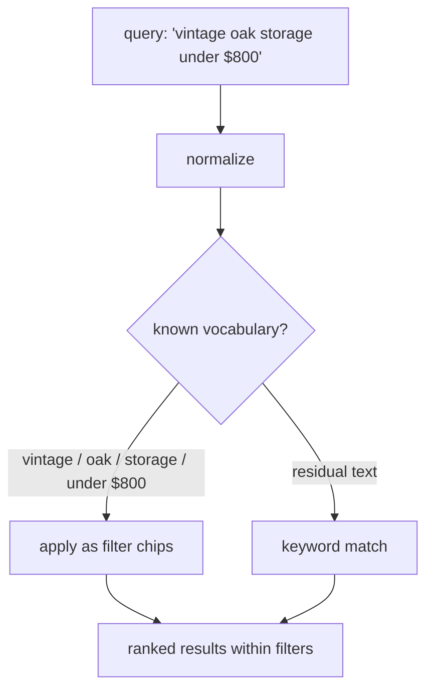

# Product Discovery Page — Requirements

## Summary

A single Curio-branded product discovery page over the 4,000-item home goods catalog, inspired by the Fabletics listing-page: a real-time search field with an expanding overlay (recent/trending searches, suggestions, featured results), category tabs, multi-select faceted filter dropdowns with removable chips and Clear All, sorting, and a responsive scrollable results grid with a live match count.

---

## Problem Frame

The catalog is 4,000 visually-oriented home goods items (`data/products.db`) with rich facet-shaped data: 10 categories, 16 brands, and 83 tags that encode materials, styles, and product types. The objective (`objective.txt`) asks for a small discovery page where search results "feel amazing and helpful" — not a full store.

The data is deliberately imperfect: ~9% of items have missing or broken image URLs, 205 items have no rating, 415 are out of stock, 16 titles carry stray whitespace and casing, 164 items (~4.1%) have no price, and 59 prices carry comma separators. Handling this imperfection gracefully is part of the product, not an edge case. The visual reference is the Fabletics product listing page (search_spec.txt describes the target structure).

---

## Key Decisions

- **Classic layered shape, not a unified omnibox.** Search field and filter dropdowns are separate, familiar controls that compose. A single smart field that both searches and filters was considered and rejected: the classic shape guarantees a complete-feeling page at every build stage, with the wow carried by polish and ranking quality.
- **Scrollable grid with a dynamic count; curation lives in the overlay.** Results render as a responsive grid — four columns desktop, three tablet, two mobile, consistent 4:5 imagery per design_spec.txt — showing all matching entries as the shopper scrolls, with a live match count. The anti-decision-fatigue curation moved into the search overlay's featured/trending product rows. (This supersedes the earlier curated-carousel decision and restores the search_spec.txt / design_spec.txt grid.)
- **Intelligence through ranking and light query understanding — no semantic/AI/chat search.** The search box recognizes catalog vocabulary and price phrases and applies them as filter chips; embeddings and conversational interfaces are out.
- **Items without a usable image are excluded from results.** Both null-image rows (183) and broken-CDN rows (168) never surface — no placeholder cards. Accepted cost: ~350 items (~9%) are unreachable through this page.
- **Material, style, and product-type facets are derived.** They are not data columns; a curated tag-to-facet mapping partitions the 83 tags into materials (oak, brass, rattan, ...), styles (vintage, minimal, handwoven, ...), and product types (lamp, tray, vase, ...). The mapping is an editorial artifact this feature owns.
- **Imperfect data is shown honestly.** Out-of-stock items appear but are visibly marked; unrated items appear without a rating value; missing-price items are excluded only while a price filter is active. Accepted cost: with 164 price-less items, ~4% of surfaceable items are hidden whenever a price-range filter is on.
- **Fabletics-style chrome and search overlay.** A black top bar with the dark Curio banner sits above a light header row (Curio banner left, search right) — knowingly departing from design_spec.txt's ivory header mapping for the top bar. Clicking the search field expands a Fabletics-style overlay pane with a Close button: recent searches, trending searches, and a trending-products card row when empty; prefix-emphasized completions plus featured result cards while typing.
- **Real-time search, no reloads.** Queries execute as the user types; results and URL update in place. Pairs with the lightest-weight mechanics available (catalog is small enough to search client-side).
- **Layered build with a protected core.** The core that must be excellent end-to-end: keyword search, faceted filtering with chips, the results grid with its dynamic count, and sorting. Enhancements — grouped autocomplete, visual browse rail, query understanding, no-results intelligence — layer on independently and are individually cuttable; their build order is planning's call.

---

## Requirements

**Header and branding**

- R27. A black top bar spans the page rendering the dark Curio banner (`branding/curio-banner-dark.png`), mirroring the Fabletics double-header reference.
- R28. Below it, a light header row shows the Curio banner (`branding/curio-banner.png`) on the left and the prominent search field on the right.

**Search**

- R1. One prominent search field queries across product title, brand, category, material, and style vocabulary, with descriptions as a low-weight fallback field — description matches always rank below title, brand, and tag matches.
- R2. Matching is forgiving: typo tolerance, case and whitespace normalization, and near-vocabulary matching (e.g. "handcrafted" matches hand-thrown and handwoven items).
- R4. Results rank by relevance, blending match strength with rating, review-count, and stock signals — in-stock items outrank otherwise-equal out-of-stock items.
- R31. Search is real-time: results, counts, and the overlay update in place as the user types, with no page reload; the URL updates in place so searches stay shareable.

**Filters and chips**

- R5. Multi-select faceted filters: category, product type, material, style, brand, price range, rating, and stock.
- R6. Material, style, and product-type facet values come from the curated tag-to-facet mapping; an item belongs to a facet value when the term appears in its tags or its title, so tag gaps never hide matching items.
- R7. Every active filter renders as a chip below the filter bar; each chip is individually removable, and a Clear All control removes every active filter at once.
- R33. A macro-category tab row (All plus the ten catalog categories — Storage, Bath, Textiles, ...) sits above the filter bar; selecting a tab applies that category filter.
- R8. Search and filters compose — active chips constrain keyword results.
- R24. Filter dropdown options show live result counts within the current selection; options that would yield zero results are disabled rather than hidden.

**Results display**

- R9. Matches render as a responsive grid — four columns desktop, three tablet, two mobile, consistent 4:5 images — showing all matching entries as the shopper scrolls down the page.
- R10. A dynamic match count (e.g. "503 Results") is always visible and updates live with every query and filter change.
- R11. Cards show a large image and minimal metadata (title, price when present, rating when present).
- R12. Items without a usable image (null or broken URL) are excluded from results and counts; broken-CDN items are identified by URL host pattern at query time, with load-error handling as a runtime safety net.
- R23. With no query or filters active, the results area shows the image-usable catalog ranked by the default sort, with the total count visible — the landing state is core, independent of the browse rail.
- R26. Cards are display-only: hover gives image-scale feedback per design_spec.txt; there is no click action, quick-view, or overlay.

**Sorting**

- R13. Sort options in a quiet dropdown: Most Relevant (default), Newest, Best Sellers (most reviewed), Top Rated, Price: High-Low, and Price: Low-High; items missing the sorted field go last.

**Data handling**

- R14. Titles are normalized (trimmed, consistent casing) for both display and matching.
- R15. Out-of-stock items appear in results with an "Out of stock" badge in the muted-olive availability treatment from design_spec.txt, and are filterable via the stock facet.
- R16. Unrated items display without a rating value rather than a zero.
- R17. Items missing a price are excluded while a price-range filter is active.

**Feel**

- R18. Result, chip, and overlay changes animate smoothly — no jarring reflows or content jumps; motion stays restrained per design_spec.txt (transitions under ~300ms, no gratuitous animation on every refresh).
- R19. The page remains usable at mobile widths; the grid collapses to two columns per design_spec.txt.
- R25. Chips, filter dropdowns, category tabs, and the search overlay are keyboard-operable (including Close); the match count updates through an ARIA live region; touch targets for chip removal and controls meet minimum size guidance.
- R32. Colors, gradients, and typography follow design_spec.txt's "Obsidian + Bone + Oxide" direction — including the dark-mode palette, the sparing oxide-accent rubric, and its restraint guidance on gradients and effects.

**Enhancements (cuttable layer)**

- R3. Known vocabulary and price phrases in a query are applied as removable filter chips when the search runs, with the residual text treated as a keyword search.

- R20. Typing in the search field opens an overlay panel showing Top Suggestions — query completions drawn from product, brand, category, material, and style vocabulary, with the typed prefix visually emphasized; selecting one runs that search rather than directly applying a chip.
- R29. Clicking the search field expands the overlay pane, dismissed by an explicit Close button; while empty it shows Recent Searches (persisted in the browser, with a Clear All control), Trending Searches, and a Trending Products card row.
- R30. Alongside suggestions while typing, the overlay shows Featured Results — the top matching product cards, updating live as the query narrows; a specific query (e.g. a full product name) collapses suggestions to it and features that product's cards.
- R21. A visual browse rail of image category cards sits above results; tapping a card applies that category filter.
- R22. The no-results state suggests removing specific active filters, offers related terms, and shows close matches.

---

## Key Flows

- F1. Keyword search
  - **Trigger:** Shopper types "pen holder" and submits.
  - **Steps:** Query normalizes; forgiving match runs across title, brand, and tag vocabulary; the grid updates in place to the ranked matches with the dynamic count shown.
  - **Covers:** R1, R2, R4, R9, R10
- F2. Stacked filtering
  - **Trigger:** Shopper opens the Material dropdown and checks Oak, then adds a price range.
  - **Steps:** Each selection adds a chip; the grid and count animate to the narrowed set after each change; removing a chip (or Clear All) restores the wider set.
  - **Covers:** R5, R7, R8, R18
- F3. Interpreted query (enhancement layer)
  - **Trigger:** Shopper types "vintage oak storage under $800".
  - **Steps:** Style, material, category, and price chips apply automatically; remaining results rank by relevance within those filters; shopper removes the price chip to widen.
  - **Covers:** R3, R7, R4
- F4. Browse before searching
  - **Trigger:** Shopper lands with no query in mind.
  - **Steps:** Scans the category tabs or card rail, taps Storage; the category applies and the grid shows Storage items with the count updated.
  - **Covers:** R21, R7
- F5. Dead end recovery
  - **Trigger:** Stacked filters plus a narrow query produce zero matches.
  - **Steps:** No-results state names which chip to remove, suggests related terms, and shows close matches.
  - **Covers:** R22

---

## Acceptance Examples

- AE1. **Covers R1, R2.** Given "handcrafted" appears only in item descriptions (never in tags or titles), when the shopper searches "handcrafted vase", then vases whose descriptions match surface near the top rather than zero results, ranked below any direct title or tag matches.
- AE2. **Covers R2, R14.** Given the row titled `  VINTAGE OAK BIN ` (padded, all-caps), when the shopper searches "vintage oak bin", then the item matches and its card displays a clean title.
- AE3. **Covers R3 (enhancement layer).** Given the query "wall art under $800", when the search runs, then a Wall Art category chip and an under-$800 price chip apply, and every result respects both.
- AE4. **Covers R12.** Given 183 items with no image and 168 with broken CDN URLs, when any search or filter runs, then none of those items appear and the match count excludes them.
- AE5. **Covers R13, R16.** Given 205 items with no rating, when the shopper sorts by rating, then unrated items sort last and their cards show no rating value.
- AE6. **Covers R17.** Given the 164 items with no price, when no price filter is active they can appear in results, and when any price-range filter is active they cannot.
- AE7. **Covers R6.** Given 74 items with "oak" in the title but no oak tag, when Oak is applied as a material — from the dropdown or an interpreted query — then those items still match, and an interpreted query never returns fewer items than the same terms as plain keywords.

---

## Success Criteria

- Searches and filter changes feel instant; grid, chip, and overlay animations are smooth, never janky.
- A messy query like "bras stool outdor" still puts brass stools at the top of the grid.
- A first-time visitor can go from an empty page to a refined, filtered result set without instructions.
- The core flow (search + filter + grid) is finished and polished before any enhancement layer lands.

---

## Scope Boundaries

- No product detail pages, cart, checkout, or accounts — the discovery page is the entire product surface.
- No quick-view, card overlay, or any card click action — cards are display-only.
- No chat-style, conversational, or embedding-based search.
- The unified omnibox shape (autocomplete entries applying chips directly) is out; autocomplete only completes text.
- No capped or carousel-style main results view — the grid shows every match; curation appears only inside the search overlay.

---

## Dependencies / Assumptions

- The tag-to-facet mapping is feasible: verified that the 83 tags partition cleanly into materials, styles, product types, and category mirrors.
- Example queries are satisfiable: "vase" matches 88 items, "pen holder" 92.
- Prices are stored as text — 164 null and 59 with comma separators (e.g. "1,081.43") — and must be normalized before numeric comparison; naive parsing reads comma values as ~1.
- Product images are placeholder photos (picsum seeds), not real product shots — the aesthetic ceiling of the cards is accepted.
- The Next.js version in this repo has breaking changes; implementation must follow the guides in `node_modules/next/dist/docs/` per `AGENTS.md`.

---

## Outstanding Questions

**Deferred to planning**

- Search implementation (SQLite FTS, in-memory index, or hybrid) and the exact ranking formula.
- UI component approach — shadcn/ui with Motion for animations was recommended in dialogue.
- Grid rendering strategy for large result sets (lazy images, incremental render) and exact responsive breakpoints.
- Final card metadata set beyond title, price, and rating.

---

## Sources

- `objective.txt` — the exercise brief; `search_spec.txt` — the target structure and its rationale; `design_spec.txt` — the visual design rubric (palette, typography, layout, and motion guidance).
- `data/products.db` (`items`, 4,000 rows) — schema and dirty-data findings verified by direct query: 10 categories, 16 brands, 83 tags, 205 unrated, 415 out of stock, 351 without usable images, 16 dirty titles, 164 null prices, prices stored as text.
- Visual reference: Fabletics product listing page (https://www.fabletics.com/mens/bottoms/pants); `ProductPageLayout.png` — full-page layout reference (double header, browse rail, filter bar with chips and Clear All, sort control, result count, grid); Fabletics search-overlay screenshots (recent/trending searches, top suggestions with featured results).
- `branding/` — curio-banner.png (dark-on-light), curio-banner-dark.png (light-on-dark), curio-icon.png.
