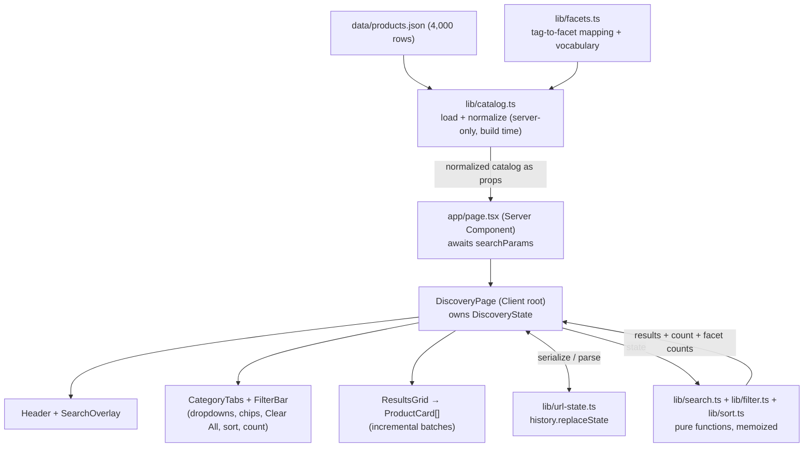
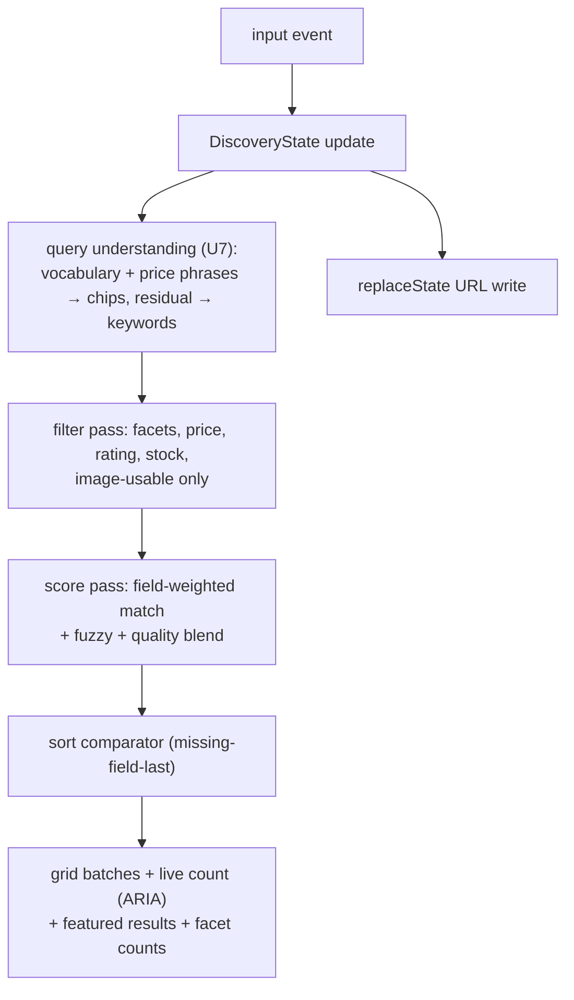

# feature: Curio product discovery page - final accepted plan

## Summary

Build the complete Curio discovery page in one pass: a statically-rendered Next.js 16 page that preloads the normalized catalog into the browser and runs all search, filtering, and sorting client-side for instant real-time results. Fabletics listing-page chrome is adapted into Curio's final accepted visual language: a black utility bar, compact white logo/search bar, full-width room banner, category tabs with the Curio C mark, faceted controls, a scrollable product grid, and a compact expanding search overlay. The final palette is white-first with restrained oxide accents, not the earlier bone/dark-mode treatment. Zero new runtime dependencies.

---

## Problem Frame

The objective (`objective.txt`) asks for a small discovery page over 4,000 home goods items where results "feel amazing and helpful." The origin document (see origin: `docs/brainstorms/2026-07-10-product-discovery-page-requirements.md`) settled the product shape: real-time search with light query understanding, faceted multi-select filters, a responsive grid of all matches with a dynamic count, and honest handling of deliberately dirty data. The repo is a fresh `create-next-app` scaffold (Next 16.2.10, React 19.2.4, Tailwind 4, TypeScript 5) — everything is greenfield, and the whole application ships in this session as the first iteration.

---

## Requirements

Origin R-IDs are canonical; this plan does not renumber them. Grouped by concern, with the units that deliver each group:

- **Header and branding** — R27 (black top bar, centered dark banner, right utility links), R28 (white header, compact banner + subheading + search). → U3
- **Search** — R1 (field weights, description as low-weight fallback), R2 (forgiving matching), R4 (relevance blend with quality signals), R31 (real-time, URL updates in place). → U2, U5
- **Filters and chips** — R5 (eight facets), R6 (tag-to-facet mapping, title fallback), R7 (chips + Clear All), R8 (search and filters compose), R24 (live option counts, zero-count disable), R33 (category tabs). → U1, U2, U5
- **Results display** — R9 (responsive grid, all matches), R10 (dynamic count), R11 (card metadata), R12 (image-unusable exclusion), R23 (landing state), R26 (display-only cards). → U4
- **Sorting** — R13 (six options, missing-field-last). → U2, U5
- **Data handling** — R14 (title normalization), R15 (out-of-stock badge), R16 (unrated display), R17 revised so null-price and `$0` items are removed from every surfaced catalog view. → U1, U2, U4
- **Feel** — R18 (restrained animation), R19 (mobile grid), R25 (keyboard + ARIA), R32 revised to a white-first Curio palette with restrained oxide accents and no automatic dark-mode inversion. → U3–U6, U8
- **Enhancement layer** — R3 (query understanding), R20 (suggestions), R29 (overlay empty state + Close), R30 (featured results), R21 (browse rail), R22 (no-results intelligence). → U6, U7

Origin flows F1–F5 and acceptance examples AE1–AE7 are carried as constraints; test scenarios below cite them.

---

## Key Technical Decisions

- **Read `data/products.json`, not `products.db`.** Verified by direct scan: the JSON carries the same 4,000 rows and the same dirty data as the DB (141 string-typed prices, 164 null prices, 205 null ratings, 183 null images, 168 `cdn.catalog.example` broken-host URLs, 415 out of stock, 16 dirty titles, 207 missing descriptions). Reading JSON with `node:fs` in a Server Component needs no SQLite driver — zero new runtime dependencies.
- **Catalog normalization excludes unsurfaceable rows.** Items with null images, the broken `cdn.catalog.example` host, parsed price `null`, or parsed price exactly `0` are removed before reaching the client. Null-price and `$0` products must not appear in landing grids, search results, filters, featured results, or trending products.
- **Client-side search over a preloaded catalog.** The page's Server Component loads and normalizes the catalog once at build time and passes it as props to the client root. Every keystroke filters in memory (4,000 items score in single-digit milliseconds) — no API routes, no per-keystroke network, and search/filter/sort share one pure-function engine. Raw JSON is 1.3 MB (~200 KB compressed in the RSC payload); acceptable for this catalog size, with a static-file fetch as the recorded fallback if hydration weight proves problematic.
- **Hand-rolled search engine, no library.** Pure TypeScript: token normalization, field-weighted scoring (title > brand > tags/category > description per R1), prefix matching for live typing, bounded edit-distance fuzzy matching for typo tolerance (R2), and a rank blend of match strength with rating, review count, and stock (R4). A library (Fuse.js, MiniSearch) would add a dependency to do less than what R1/R4's custom weighting needs.
- **Native HTML + Tailwind 4 + CSS transitions — no component library.** Consciously overrides design_spec.txt's closing shadcn/Radix note, per the lightest-weight directive. Dropdowns are custom popovers over native inputs (checkboxes/radios are keyboard-accessible for free); animation is CSS transitions under 300ms per the interaction rubric. Motion library only if CSS proves insufficient (not expected).
- **URL state via `history.replaceState`, initial state from async `searchParams`.** Typing updates the URL in place without router navigation (R31); a shared serializer round-trips query, filters, and sort. The page reads `searchParams` (a Promise in Next 16 — must be awaited) so shared URLs restore full state server-side.
- **Incremental grid rendering.** All matches are reachable by scroll (R9), but the DOM renders in batches (~48 cards) appended via an IntersectionObserver sentinel; images use fixed 4:5 aspect boxes with native lazy loading. Full virtualization is deferred — batching alone keeps the landing state (≈3,650 image-usable items) smooth.
- **White-first Curio design tokens.** The accepted visual direction replaces the earlier bone/dark-mode palette for the page shell: `background` and `surface` are white, text remains near-black, borders are soft warm gray, and oxide is reserved for selected states and subtle accents. `prefers-color-scheme` must not invert the storefront into a dark/brown page.
- **Hero banner is a real room image.** A full-width horizontal room banner sits below the header and carries the copy, "Your space, beautifully curated and thoughtfully considered." The older supporting headline, "Find the piece that makes the room feel considered," is removed entirely.
- **Trending/suggestion vocabulary is derived from the catalog, not curated.** Search vocabulary (brands, categories, materials, styles, product types) comes from the U1 facet mapping; Trending Searches are the top vocabulary terms by aggregate review count. Trending Products are the highest total-rating products using `rating * reviews`.
- **UI verification replaces broad test harness work for this demo pass.** The app must build successfully; pure-function tests remain follow-up work unless the project later adds Vitest intentionally.

**Execution posture:** continuous single-session build in dependency order U1→U8. The app is bootable and reviewable from U3 onward; U7 (enhancement layer) and U8 (polish) land last so the protected core is never hostage to them. Before writing code for each unit, read the Next.js guides named in that unit's Patterns — `AGENTS.md` mandates this because Next 16 breaks from training data.

---

## Final Accepted Change Requests

These acceptance criteria replace conflicting earlier plan language from the initial design pass.

- **Page background:** The whole app shell uses white background and white surface tokens so the page blends with Curio's white brand treatment. No automatic dark-mode palette should make the storefront brown or black.
- **Top black bar:** The black bar keeps a centered Curio dark banner with balanced top/bottom padding. On the right, smaller white utility links render as `Help & Contact`, `Store Locations`, and `Sign In`, each with a white icon.
- **White header row:** The Curio logo block is compact, with `Curated Home Goods` below the logo. The search input placeholder is exactly `Search`.
- **Search input treatment:** The search bar includes a magnifying-glass icon on the left. Focus removes the oxide double outline and instead adds a neutral depth shadow. When expanded, `Close` appears to the right of the search bar.
- **Hero banner:** A real room image spans the page horizontally below the header. The only hero copy over the image is "Your space, beautifully curated and thoughtfully considered."
- **Category tabs:** The category bar includes the Curio C logo to the left of `All`; active tabs use the restrained oxide underline.
- **Expanded search empty state:** The panel is capped in height and scrolls internally instead of taking the whole screen. Recent Searches show only the latest three items. Trending Searches show only three items. There is no `Clear All` action.
- **Expanded search products:** With no query, a `Trending Products` strip appears using the products with highest `rating * reviews`. While typing, `Featured Results` appears with the same heading style, card sizing, and grid layout as Trending Products.
- **Search-panel product cards:** Trending/featured cards inside the search panel show only image and item name. Brand, price, rating, and review count are not shown there. The main product grid keeps full product metadata.
- **Null/zero-price exclusion:** Any item whose parsed price is `null` or exactly `$0` is excluded from all user-facing surfaces.

---

## High-Level Technical Design

Component and data-flow topology — directional guidance, not implementation specification:



Per-keystroke pipeline (same engine serves the grid, the count, the facet counts, and the overlay's featured results):



---

## Output Structure

Scope declaration, not a constraint — per-unit Files lists are authoritative:

```text
src/
  app/
    layout.tsx            (modified: fonts, metadata, body styling)
    page.tsx              (rewritten: Server Component entry)
    globals.css           (rewritten: white-first design tokens, @theme)
  components/
    discovery-page.tsx    (client root, state owner)
    header.tsx            (black utility bar + white logo/search row)
    search-overlay.tsx    (compact expanding pane: recent/trending/products/suggestions/featured)
    category-tabs.tsx
    filter-bar.tsx        (facet dropdowns, chips, Clear All, sort, count)
    results-grid.tsx      (incremental batches, sentinel)
    product-card.tsx
  lib/
    types.ts              (Item, NormalizedItem, DiscoveryState, facet types)
    catalog.ts            (server-only load + normalize)
    facets.ts             (tag partition, vocabulary, facet membership)
    search.ts             (scoring engine)
    filter.ts             (predicates + facet counts)
    sort.ts               (comparators)
    url-state.ts          (serialize/parse)
    recent-searches.ts    (localStorage)
public/branding/          (banner assets copied for static serving)
```

---

## Implementation Units

### U1. Catalog foundation: load, normalize, facet mapping

- **Goal:** A server-only module that turns `data/products.json` into a clean, typed, client-ready catalog, plus the editorial tag-to-facet mapping that powers all facet and vocabulary features.
- **Requirements:** R6, R12, R14, R17 (parse side); AE2, AE4 groundwork.
- **Dependencies:** none.
- **Files:** `src/lib/types.ts`, `src/lib/catalog.ts`, `src/lib/facets.ts`, `package.json`.
- **Approach:** Normalize per item: trim/title-case dirty titles (display and matching share the normalized form); parse price to `number | null` (strip commas from string prices — 141 string-typed, some comma-formatted); keep `rating: number | null`; parse `releasedAt` to a sortable value. Exclude items whose image is null, whose URL host matches the broken-CDN pattern (`cdn.catalog.example`), whose parsed price is `null`, or whose parsed price is exactly `0` — they never reach the client (R12 plus final null/zero-price rule). The facet mapping partitions the 83 distinct tags into materials, styles, and product types (feasibility verified in the origin doc); facet membership checks tags first, then normalized title (R6). Export derived vocabulary lists (brands, categories, materials, styles, product types) for search and suggestions.
- **Patterns to follow:** `node_modules/next/dist/docs/01-app/01-getting-started/06-fetching-data.md` (Server Components read data directly; static rendering default).
- **Test scenarios:**
  - Covers AE2. The padded all-caps title `  VINTAGE OAK BIN ` normalizes to clean display casing and matches the query "vintage oak bin".
  - Covers AE4 plus final null/zero-price rule. Normalized catalog excludes null-image rows, `cdn.catalog.example` rows, parsed null-price rows, and all parsed `$0` rows; no surviving item has a broken image host, price `null`, or price `0`.
  - String price `"1,081.43"` parses to `1081.43`; numeric prices pass through; null parses as null and is omitted from the surfaced catalog.
  - Facet mapping completeness: every one of the 83 tags is assigned to exactly one facet family or a conscious pass-through list — no silent drops.
  - Covers AE7 groundwork. An item with "oak" in the title but no oak tag is a member of the Oak material facet.
- **Verification:** Production build green; a scratch inspection confirms null-price and zero-price rows are excluded from normalized catalog output.

### U2. Discovery engine: search, filter, sort, facet counts

- **Goal:** The pure-function core — scoring, filtering, sorting, and live facet counts — that every UI surface consumes. This unit carries most of the product's "feels amazing" quality.
- **Requirements:** R1, R2, R4, R5 (logic), R8, R13, R15 (stock facet), R16 (sort placement), R17, R24; F1, F2 logic; AE1, AE5, AE6, AE7.
- **Dependencies:** U1.
- **Files:** `src/lib/search.ts`, `src/lib/filter.ts`, `src/lib/sort.ts`.
- **Approach:** Scoring: normalize query and fields to lowercase trimmed tokens; weight title > brand > tags/category > description (description matches always rank below any title/brand/tag match — implement as a score tier, not just a lower weight, per AE1); prefix matches count so live typing ranks sensibly; fuzzy match via bounded edit distance (≤1 for tokens of 4–7 chars, ≤2 above; skip shorter tokens) to satisfy "bras stool outdor". Final rank blends match score with rating, log-scaled review count, and an in-stock edge that breaks ties in favor of stocked items (R4). Filters are composable predicates (multi-select OR within a facet family, AND across families); null-price and zero-price items have already been removed by catalog normalization (R17 revised). Facet counts are computed within the current selection *excluding the facet family being counted* (standard faceted-search behavior so options show what selecting them would yield); zero-count options report disabled, not hidden (R24). Sorts: Most Relevant (rank blend; with an empty query, pure quality blend), Newest (`releasedAt` desc), Best Sellers (reviews desc), Top Rated (rating desc), Price both directions.
- **Test scenarios:**
  - Covers F1. "pen holder" returns ranked matches; count matches a manual filter of the fixture.
  - Covers AE1. With "handcrafted" present only in descriptions, "handcrafted vase" surfaces description-matched vases above zero-results, ranked below any direct title/tag matches for "vase".
  - Typo tolerance: "bras stool outdor" ranks brass stools at the top; "OAK  bin" (case/whitespace) matches oak bins.
  - Covers AE7. Oak-in-title-only items match the Oak material filter, and an interpreted "oak" query never returns fewer items than plain-keyword "oak".
  - Covers AE5. Sort by Top Rated places all 205 unrated items last.
  - Covers AE6 revised. Null-price and zero-price items are omitted before search/filtering and never appear with or without a price filter.
  - In-stock beats out-of-stock at equal match quality (R4).
  - Facet counts: selecting Oak updates Style counts to oak-only sub-counts; a zero-yield option is flagged disabled.
  - Filters compose with search (R8): query "vase" + brand filter returns only that brand's vases.
- **Verification:** Production build green; focused manual queries (`pen holder`, `handcrafted vase`, `bras stool outdor`, `OAK bin`) produce plausible ranked results. Unit tests remain deferred follow-up.

### U3. App shell, white design tokens, chrome

- **Goal:** The branded page skeleton: white-first design-token system, fonts, both header bars, room hero banner, and Next config — the app boots and looks like Curio from here on.
- **Requirements:** R27, R28, R32; R19 baseline.
- **Dependencies:** none (parallel-safe with U1/U2; build order still U1→U2→U3).
- **Files:** `src/app/globals.css`, `src/app/layout.tsx`, `src/app/page.tsx`, `src/components/header.tsx`, `next.config.ts` (images.remotePatterns for `picsum.photos`), `public/branding/` (copy banner PNGs and room banner for static serving).
- **Approach:** Encode the accepted Curio palette as CSS custom properties consumed through Tailwind 4 `@theme`: white page/background surfaces, near-black text, warm-gray secondary text, soft warm borders, oxide only for selected states/hover accents, muted olive for stock messaging. Do not add a `prefers-color-scheme` override that makes the page dark. Fonts: keep Geist for UI, add Instrument Serif for display/product names. Header: black top bar with a centered `curio-banner-dark.png`, balanced vertical padding, and right-aligned white utility links (`Help & Contact`, `Store Locations`, `Sign In`) with compact icons. White row below: compact `curio-banner.png` left, `Curated Home Goods` subheading below it, prominent search field right with left magnifying-glass icon, placeholder exactly `Search`, neutral focus shadow, and no oxide double outline. Add the full-width room image banner under the header with the copy "Your space, beautifully curated and thoughtfully considered." Remove the earlier supporting headline from below the banner. Update metadata (title "Curio", icon from `curio-icon.png`).
- **Patterns to follow:** `node_modules/next/dist/docs/01-app/01-getting-started/11-css.md`, `13-fonts.md`, `12-images.md`; existing `src/app/layout.tsx` font wiring.
- **Test scenarios:** Test expectation: none — scaffolding and styling; verified visually.
- **Verification:** `npm run dev` renders both header bars with correct banners, white shell, balanced black-bar logo margins, right utility links, search field treatment, and full-width room hero. Images from picsum load through `next/image` without config errors.

### U4. Results grid, cards, count, landing state

- **Goal:** The core results surface: responsive grid of all matches with incremental rendering, quiet product cards, live count, and the full-catalog landing state.
- **Requirements:** R9, R10, R11, R12 (runtime net), R15, R16 (display), R18, R19, R23, R25 (live region), R26.
- **Dependencies:** U1, U2, U3.
- **Files:** `src/components/discovery-page.tsx`, `src/components/results-grid.tsx`, `src/components/product-card.tsx`, `src/app/page.tsx` (final wiring: load catalog, await `searchParams`, render client root).
- **Approach:** `DiscoveryPage` (client) owns a single `DiscoveryState` and derives `{results, count, facetCounts}` via memoized engine calls, with `useDeferredValue` on the query if grid updates ever lag typing. Grid: CSS grid 4/3/2 columns (desktop/tablet/mobile), 4:5 aspect-ratio image boxes (no layout shift), batches of ~48 appended by an IntersectionObserver sentinel. Cards are display-only: image dominates, serif title, price (omitted when null), warm-gray brand and rating + review count (omitted when unrated — never a zero, R16), muted-olive "Out of stock" badge (R15), subtle image scale on hover (R26); an `onError` handler hides cards whose image fails at runtime (R12 safety net). Count renders as "N Results" in an `aria-live="polite"` region (R10, R25). Landing state: no query/filters → full image-usable catalog in default sort with total count (R23). Grid transitions: brief fade on result-set change, under 300ms, no per-refresh animation (R18).
- **Patterns to follow:** `node_modules/next/dist/docs/01-app/01-getting-started/05-server-and-client-components.md` (serializable props across the boundary), `12-images.md`.
- **Test scenarios:** Test expectation: none — rendering layer over the tested engine; verified visually: landing count reflects the image-usable, non-broken, non-null-price, non-zero-price catalog; scroll appends batches to exhaustion; card variants (no rating / out of stock) render per spec; mobile shows two columns.
- **Verification:** Dev-server walkthrough of the landing state, a search, and all card variants in the accepted white shell; no layout shift while images stream in.

### U5. Filter chrome, category tabs, sort, URL state

- **Goal:** The full Fabletics filter experience — tabs, dropdowns with live counts, chips with Clear All, sort menu — wired to real-time state and a shareable URL.
- **Requirements:** R5, R7, R8, R13 (UI), R24, R25, R31, R33; F2, F4 (tabs).
- **Dependencies:** U2, U4.
- **Files:** `src/components/category-tabs.tsx`, `src/components/filter-bar.tsx`, `src/lib/url-state.ts`, `src/components/discovery-page.tsx` (wiring).
- **Approach:** Category tab row includes the Curio C icon at the far left, followed by All + ten categories above the filter bar; active tab gets the oxide underline (R33). Filter bar: one popover dropdown per facet family (product type, material, style, brand, price presets, rating threshold, availability) built on native checkbox/radio inputs inside a button-triggered popover — outside-click and Escape close it; options show live counts and disable at zero (R24). Active filters render as chips below the bar (near-black active treatment per the spec), each removable, plus Clear All (R7). Sort: quiet dropdown with the six R13 options. Every change updates state and serializes to the URL with `history.replaceState`; debounce URL writes (~300ms) while typing (R31). Initial state parses from awaited `searchParams` in `src/app/page.tsx` so shared URLs restore query, filters, and sort.
- **Patterns to follow:** `node_modules/next/dist/docs/01-app/01-getting-started/03-layouts-and-pages.md` (async `searchParams` — Next 16 breaking change).
- **Test scenarios:**
  - URL round-trip: serialize(parse(s)) is identity for query + multi-facet + price + sort combinations; empty state serializes to a clean URL (no residual params).
  - Malformed/unknown params parse to defaults, never throw.
  - Covers F2 (visual): checking Oak then a price range stacks two chips; removing one restores the wider set; Clear All empties everything; count updates live.
  - Covers F4 (visual): tapping the Storage tab filters the grid and updates the count; the Curio C mark remains at the far left of the tab bar.
- **Verification:** Dev-server: filter stacking, chip removal, Clear All, sort switching all update grid + count with no reload; pasting a filtered URL into a new tab restores the exact state.

### U6. Compact search overlay: recent, trending, products, suggestions, featured results

- **Goal:** The expanding search pane — compact empty state (Recent Searches, Trending Searches, Trending Products) and typing state (prefix-emphasized suggestions + live Featured Results), with an explicit Close beside the search bar.
- **Requirements:** R20, R25, R29, R30, R31; R18.
- **Dependencies:** U2, U4, U5.
- **Files:** `src/components/search-overlay.tsx`, `src/lib/recent-searches.ts`, `src/components/header.tsx` (wiring).
- **Approach:** Clicking/focusing the search field expands a white overlay pane below the header; the pane is capped in height and scrolls internally so it does not consume the full viewport. `Close` sits to the right of the search input; Escape also closes and returns focus sensibly (R25). Empty state: Recent Searches from localStorage (deduped, latest 3 only, no Clear All), Trending Searches (top 3 derived-vocabulary terms by aggregate review count), and a right-side Trending Products strip ranked by `rating * reviews` (R29). Typing state: Recommended Searches — up to 3 vocabulary completions with the typed prefix visually emphasized, selecting one runs that search (R20) — beside Featured Results, the engine's top 3 cards updating live per keystroke (R30). Recent/Trending/Featured/Trending Products headings share the same bold uppercase sans style. Search-panel product cards show only image + item name; brand, price, rating, and reviews are omitted in the overlay. The grid beneath keeps updating live — the overlay augments, never blocks, real-time results (R31).
- **Test scenarios:**
  - `recent-searches`: records committed queries, dedupes repeats to most-recent, shows only the latest three, and tolerates unavailable/corrupt localStorage without throwing.
  - Visual: empty-field focus shows Recent Searches, Trending Searches, and Trending Products without a Clear All button; typing "ra" emphasizes the prefix in suggestions and shows live Featured Results cards; product cards in the overlay show only image + item name; Close/Escape restore the header.
- **Verification:** Dev-server walkthrough of both overlay states, keyboard-only operation (Tab/Enter/Escape), persistence of recents across a reload, and visual parity between Featured Results and Trending Products card layout.

### U7. Enhancement layer: query understanding, no-results, browse rail

- **Goal:** Deferred follow-up intelligence layer: vocabulary/price phrases become chips, dead ends recover helpfully, and a visual category rail invites browsing.
- **Requirements:** R3, R21, R22; F3, F4 (rail), F5; AE3, AE7 guard.
- **Dependencies:** U2, U5, U6.
- **Files:** Deferred; not part of the accepted demo commit.
- **Approach:** `query-parse` scans a committed query against the U1 vocabulary (materials, styles, categories, product types) and price phrases ("under $800", "over $N", "$N–$M", "between N and M"); recognized terms apply as removable chips, residual text stays keyword search (R3, F3). Interpreted-query guard: if applying parsed chips yields fewer results than the same terms as plain keywords, fall back to keywords (AE7). No-results state: names which active chip(s) to remove (computed by testing each chip's removal), suggests near-vocabulary terms for likely typos, and shows closest matches under a relaxed query (R22, F5). Browse rail: image category cards (representative product image per category) above the grid; tapping applies the category (R21) — redundant with tabs by design, per the origin's browse-before-search flow.
- **Test scenarios:**
  - Covers AE3 / F3. "wall art under $800" yields a Wall Art category chip + under-$800 price chip; all results respect both; residual text is empty.
  - "vintage oak storage under $800" parses style + material + category + price chips.
  - Price phrase variants parse correctly; unrecognized text passes through as keywords untouched.
  - AE7 guard: an interpreted query never returns fewer results than its plain-keyword form (fixture where tag-chip filtering would under-match title-only items).
  - No-results helper: for a zero-match state, the removal suggestion names a chip whose removal provably yields results.
- **Verification:** Deferred follow-up; not required for the accepted demo.

### U8. Polish pass: motion, accessibility, responsive, white-shell fidelity

- **Goal:** The final quality sweep that makes the whole page feel finished — the origin's success criteria are the checklist.
- **Requirements:** R18, R19, R25, R32 revised white-shell audit; origin Success Criteria.
- **Dependencies:** U1–U7.
- **Files:** touch-ups across `src/components/` and `src/app/globals.css` as the audit dictates.
- **Approach:** Sweep in four passes: (1) motion — all transitions under 300ms, no animation on every result refresh, no jank while typing fast; (2) accessibility — keyboard paths through tabs, dropdowns, chips, overlay; visible focus treatment; ARIA labels on icon buttons; touch-target sizes on chip removal; (3) responsive — two-column mobile grid, usable filter bar and overlay at narrow widths; (4) design fidelity — side-by-side check against the final accepted screenshots and requests: white shell, compact header, balanced black-bar logo, right-side utility links, compact search overlay, room hero, and restrained oxide accents. Run `npm run build` clean as the exit gate.
- **Test scenarios:** Test expectation: none — audit unit over tested/verified behavior; the origin Success Criteria section is the manual checklist.
- **Verification:** Production build succeeds; a keyboard-only session can go from empty page to a refined filtered result set; "bras stool outdor" demo reads well; white page shell and compact search overlay hold up across primary surfaces.

---

## Scope Boundaries

Carried from origin:

- No product detail pages, cart, checkout, or accounts — the discovery page is the entire surface.
- No card click action, quick-view, or overlay — cards are display-only.
- No chat-style, conversational, or embedding-based search; no unified omnibox (autocomplete only completes text).
- No capped or carousel-style main results view — the grid shows every match; curation lives only in the search overlay.

### Deferred to Follow-Up Work

- Grid virtualization (react-window-class) — only if incremental batching proves insufficient.
- Serving the catalog as a static fetched JSON instead of RSC props — only if hydration payload weight becomes a real problem.
- Playwright/E2E coverage of the UI layer.
- Real product imagery (picsum placeholders cap the aesthetic ceiling; accepted in origin).
- Full query-understanding chips, browse rail, and richer no-results helper.
- Vitest coverage for pure search/filter/url/recent-search modules.
- CICD and Deployment pipelines for quality and reliability to end users. 
- Added storefront pages for various categories or item cards expanded, adding functionality for shopping carts, authentication etc.

---

## Risks & Dependencies

- **Next 16 API drift from training data.** Highest-likelihood failure mode. Mitigation is procedural: read the named guide in `node_modules/next/dist/docs/` before each unit's code (async `searchParams`, image config, font loading are the known traps).
- **Facet-mapping quality is editorial.** A sloppy tag partition degrades filters and query understanding everywhere. Mitigation: the U1 completeness test plus spot-checks against real tag values.
- **picsum image latency/flakiness.** Fixed aspect boxes prevent layout shift; lazy loading bounds request volume; `onError` hides dead cards.
- **RSC payload weight (~1.3 MB raw catalog).** Accepted for 4,000 items; fallback recorded in Deferred.
- **Scoring quality is tuning-sensitive.** Exact weights are an execution-time discovery - validate against the origin's example queries ("pen holder", "handcrafted vase", "bras stool outdor") rather than fixing constants in the plan.

---

## Deferred Implementation Notes

Execution-time unknowns, deliberately unresolved here: exact scoring weights and fuzzy thresholds (tune against example queries); grid batch size and sentinel margin; suggestion/featured-result counts in the overlay; price-preset bucket boundaries (derive from the actual price distribution); whether `useDeferredValue` is needed at all.

---

## Sources & Research

- Origin: `objective.txt` and `docs/brainstorms/product-discovery-page-requirements.md` (R1–R33, F1–F5, AE1–AE7, key decisions).
- `data/products.json` — verified by direct scan this session: 4,000 rows; 141 string prices / 164 null; 205 null ratings; 183 null images + 168 `cdn.catalog.example`; 14 parsed `$0` rows; 415 out of stock; 16 dirty titles; 207 missing descriptions; sole good image host `picsum.photos`.
- `node_modules/next/dist/docs/01-app/01-getting-started/` — guides 03 (pages/searchParams), 05 (server/client components), 06 (fetching), 11 (CSS), 12 (images), 13 (fonts); mandated by `AGENTS.md`.
- Branding: `branding/curio-banner.png`, `branding/curio-banner-dark.png`, `branding/curio-icon.png`.
